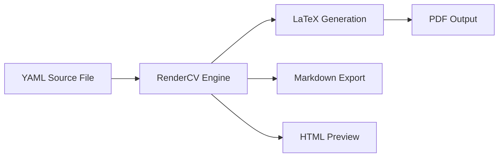

# 📄 Lucas Castro — Curriculum Vitae Repository

<p align="center">
  
  
  
  
</p>

<p align="center">
  <b>Full Stack Developer</b> • <b>Manaus, AM, Brazil</b> • <b>4+ Years Experience</b>
</p>

## 📑 Table of Contents

- [Overview](#overview)
- [Repository Structure](#repository-structure)
- [Quick Access](#quick-access)
- [File Formats Explained](#file-formats-explained)
- [Customization Guide](#customization-guide)

## 🎯 Overview

This repository contains my professional curriculum vitae (CV) / resume in multiple formats and languages. It leverages **[RenderCV](https://rendercv.com)** — a powerful YAML-based CV generator that produces beautifully typeset PDF documents from simple configuration files.

### ✨ Key Features

- 🌍 **Bilingual Support** — Available in both English (EN-US) and Portuguese (PT-BR)
- 📄 **Multiple Formats** — PDF, Markdown, and RenderCV YAML source files
- 🎨 **Professional Design** — Clean, ATS-friendly layout with customizable themes
- ⚡ **Easy Updates** — Single YAML source file generates all formats
- 🔗 **Version Controlled** — Track CV evolution with Git history
- 📱 **Web-Based Rendering** — No local dependencies required

### 💼 Professional Summary

> Full Stack Developer with **4+ years of experience** building robust web applications using **React, Vue, and Angular**. Proficient in **Node.js, Python, and .NET**. Hands-on experience in **end-to-end project** execution, including requirements gathering, performance testing, CI/CD pipelines, proof of concept, and UX/UI optimization. Delivers high-impact solutions focused on **performance and client value**.

## 📁 Repository Structure

```
curriculum-vitae/
├── 📄 LucasCastro_FullStackDeveloper_Resume-ENUS_02-02-2026.pdf
├── 📄 LucasCastro_FullStackDeveloper_LinkedInResume-ENUS_02-02-2026.pdf
├── 📝 LucasCastro_FullStackDeveloper_MarkdownResume-ENUS_02-02-2026.md
├── ⚙️ LucasCastro_FullStackDeveloper_RenderCVResume-ENUS_02-02-2026.yaml
├── 📄 LucasCastro_DesenvolvedorFullStack_Curriculo-PTBR_02-02-2026.pdf
├── 📄 LucasCastro_DesenvolvedorFullStack_CurriculoLinkedIn-PTBR_02-02-2026.pdf
├── 📝 LucasCastro_DesenvolvedorFullStack_CurriculoMarkdown-PTBR_02-02-2026.md
├── ⚙️ LucasCastro_DesenvolvedorFullStack_CurriculoRenderCV-PTBR_02-02-2026.yaml
└── 📖 README.md
```

### File Naming Convention

| Component | Description |
|-----------|-------------|
| `LucasCastro` | Full name |
| `FullStackDeveloper/DesenvolvedorFullStack` | Job title (EN/PT) |
| `Resume/Curriculo` | Document type (EN/PT) |
| `LinkedInResume/CurriculoLinkedIn` | Optimized for LinkedIn upload |
| `ENUS/PTBR` | Language and locale |
| `02-02-2026` | Last updated date (MM-DD-YYYY/DD-MM-YYYY) |
| `.pdf/.md/.yaml` | File format |

---

## 🔗 Quick Access

### English Versions 🇺🇸

| Format | File | Description |
|--------|------|-------------|
| PDF | [`Resume-ENUS.pdf`](./LucasCastro_FullStackDeveloper_Resume-ENUS_02-02-2026.pdf) | Standard professional CV |
| PDF | [`LinkedInResume-ENUS.pdf`](./LucasCastro_FullStackDeveloper_LinkedInResume-ENUS_02-02-2026.pdf) | LinkedIn-optimized version |
| Markdown | [`MarkdownResume-ENUS.md`](./LucasCastro_FullStackDeveloper_MarkdownResume-ENUS_02-02-2026.md) | Human-readable text version |
| YAML | [`RenderCVResume-ENUS.yaml`](./LucasCastro_FullStackDeveloper_RenderCVResume-ENUS_02-02-2026.yaml) | RenderCV source file |

### Portuguese Versions 🇧🇷

| Format | File | Description |
|--------|------|-------------|
| PDF | [`Curriculo-PTBR.pdf`](./LucasCastro_DesenvolvedorFullStack_Curriculo-PTBR_02-02-2026.pdf) | Currículo profissional padrão |
| PDF | [`CurriculoLinkedIn-PTBR.pdf`](./LucasCastro_DesenvolvedorFullStack_CurriculoLinkedIn-PTBR_02-02-2026.pdf) | Versão otimizada para LinkedIn |
| Markdown | [`CurriculoMarkdown-PTBR.md`](./LucasCastro_DesenvolvedorFullStack_CurriculoMarkdown-PTBR_02-02-2026.md) | Versão em texto legível |
| YAML | [`CurriculoRenderCV-PTBR.yaml`](./LucasCastro_DesenvolvedorFullStack_CurriculoRenderCV-PTBR_02-02-2026.yaml) | Arquivo fonte RenderCV |

## 🛠️ About RenderCV

[RenderCV](https://rendercv.com) is an open-source Python-based CV generator that transforms YAML configuration files into professionally typeset PDF documents.

### Why RenderCV?

| Feature | Benefit |
|---------|---------|
| **YAML-Based** | Version control friendly, human-readable source |
| **LaTeX Output** | Professional typography and layout |
| **Customizable Themes** | Multiple design options (Classic, SB2, etc.) |
| **Multi-Format Export** | PDF, Markdown, HTML, PNG |
| **ATS-Friendly** | Passes Applicant Tracking Systems |
| **Free & Open Source** | No subscription fees |

### How It Works



### Rendering Options

#### Option 1: Web App (Recommended for Beginners) 🌐
- Visit [https://app.rendercv.com](https://app.rendercv.com)
- Upload your YAML file
- Preview and download PDF instantly
- No installation required

#### Option 2: Command Line (For Power Users) 💻

```bash
# Install RenderCV
pip install rendercv

# Generate PDF from YAML
rendercv render your-cv.yaml

# Generate all formats
rendercv render your-cv.yaml --output-format pdf markdown html png
```

#### Option 3: GitHub Actions (Automated) 🤖

Set up automated CV generation on every push:

```yaml
# .github/workflows/render-cv.yml
name: Render CV
on:
  push:
    paths:
      - '**.yaml'
jobs:
  render:
    runs-on: ubuntu-latest
    steps:
      - uses: actions/checkout@v4
      - uses: actions/setup-python@v5
        with:
          python-version: '3.11'
      - run: pip install rendercv
      - run: rendercv render *.yaml
      - uses: actions/upload-artifact@v4
        with:
          name: cv-pdfs
          path: '*.pdf'
```

## 📋 File Formats Explained

### PDF (.pdf)
- **Purpose**: Primary distribution format
- **Use for**: Job applications, email attachments, LinkedIn uploads
- **Advantages**: Universal compatibility, preserves formatting
- **Two versions**: Standard (full design) and LinkedIn-optimized

### Markdown (.md)
- **Purpose**: Human-readable plain text version
- **Use for**: GitHub profile, quick viewing, version diffing
- **Advantages**: Readable in any text editor, Git-friendly diffs
- **Note**: Rendered automatically from YAML by RenderCV

### YAML (.yaml)
- **Purpose**: Source of truth — single file that generates all formats
- **Use for**: Editing and updating CV content
- **Advantages**: Structured data, easy to modify, version controlled
- **Structure**: Sections for personal info, experience, education, skills, etc.

#### Sample YAML Structure

```yaml
cv:
  name: Your Name
  location: City, Country
  email: email@example.com
  phone: +1-234-567-8900
  website: https://yourwebsite.com
  social_networks:
    - network: LinkedIn
      username: yourusername
    - network: GitHub
      username: yourusername
  
  sections:
    summary:
      - Your professional summary here...
    
    experience:
      - company: Company Name
        position: Job Title
        start_date: 2023-01
        end_date: present
        location: City, Country
        highlights:
          - Achievement 1
          - Achievement 2
    
    education:
      - institution: University Name
        area: Degree Field
        start_date: 2019-09
        end_date: 2023-06
    
    skills:
      - label: Programming Languages
        details: Python, JavaScript, Go

design:
  theme: classic
  colors:
    primary: rgb(30, 185, 85)
```

## 🎨 Customization Guide

### Changing Themes

RenderCV supports multiple themes. Edit the `design.theme` field:

```yaml
design:
  theme: classic  # Options: classic, sb2, engineering, etc.
```

### Modifying Colors

Customize the color scheme in the YAML:

```yaml
design:
  colors:
    text: rgb(0, 0, 0)
    name: rgb(30, 185, 85)      # Your name color
    section_titles: rgb(30, 185, 85)  # Section header color
    links: rgb(0, 0, 255)       # Link color
```

### Adding Sections

Add custom sections to highlight specific skills:

```yaml
sections:
  projects:
    - name: Open Source Project
      date: 2023-2024
      highlights:
        - Built with React and Node.js
        - 1000+ GitHub stars
  
  publications:
    - title: Research Paper Title
      authors: Your Name, Co-Author
      journal: Journal Name
      date: 2023
```

### Language Localization

For Portuguese or other languages, update the locale section:

```yaml
locale:
  language: pt  # or 'en', 'es', 'fr', etc.
  date_template: FULL_MONTH_NAME YEAR
  present: presente
  month: mês
  months: meses
  year: ano
  years: anos
```

---

## 🧪 Validation & Best Practices

### YAML Validation

Before rendering, validate your YAML syntax:

```bash
# Using Python
python -c "import yaml; yaml.safe_load(open('your-cv.yaml'))"

# Using yamllint
yamllint your-cv.yaml
```

### Content Best Practices

- ✅ Use action verbs: "Developed", "Implemented", "Optimized"
- ✅ Include quantifiable achievements: "Reduced load time by 80%"
- ✅ Keep bullet points concise (1-2 lines each)
- ✅ Update regularly with new experience
- ❌ Avoid personal information (photo, age, marital status)
- ❌ Don't exceed 2 pages for most industries

## 📜 License

This CV content is © 2026 Lucas Castro. All rights reserved.

The RenderCV YAML structure and workflow documentation are shared for educational purposes. Feel free to use this repository as a reference for creating your own CV, but please do not copy the personal content.

## 🙏 Acknowledgments

- [RenderCV](https://github.com/sinaatalay/rendercv) by Sina Atalay — for the amazing CV generation tool

<p align="center">
  <sub>Last updated: February 2, 2026</sub><br>
</p>
